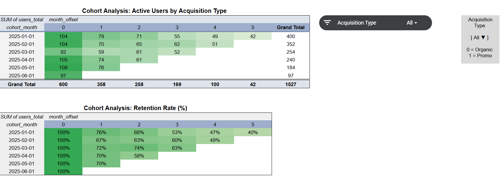
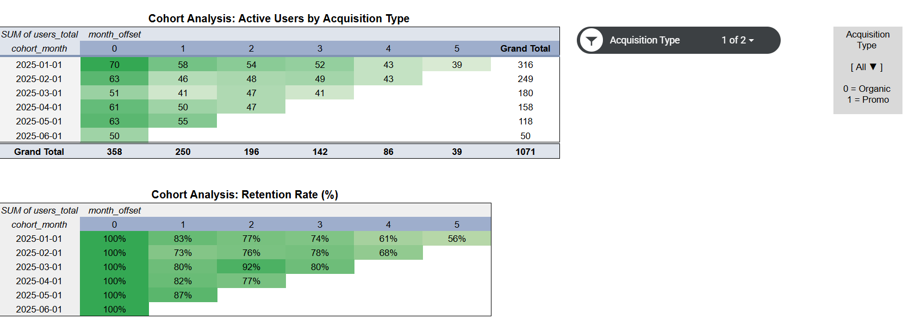
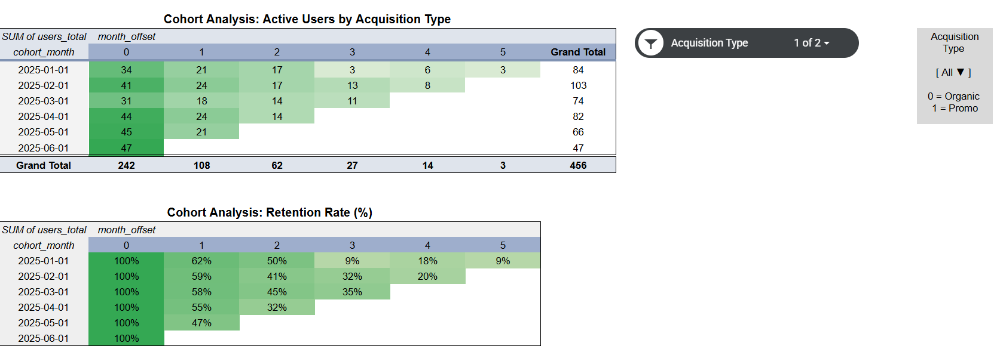

# User Retention Analysis: Promo vs. Organic Acquisition

[](sql/)
[](LICENSE)

## 📌 Executive Summary
This project evaluates customer retention dynamics across monthly registration cohorts (Jan–Jun 2025) to analyze the long-term effectiveness of customer acquisition channels. By integrating **SQL** for raw event data extraction, data cleaning, and transformation with **Google Sheets** for cohort modeling and heatmaps, this analysis investigates whether promotional campaigns deliver sustainable customer engagement compared to organic traffic.

---

## 🎯 Business Problem
* **Channel Performance**: How does user retention differ between customers acquired through promotional campaigns versus organic channels?
* **Customer Lifetime Value**: Does promotional acquisition justify initial customer acquisition costs (CAC) given the retention decay observed by Month 5?

---

## 🛠 Tech Stack
* **SQL (DBeaver / PostgreSQL)**: Data parsing, string cleaning, CTEs, multi-table `JOIN` operations, event filtering, cohort indexing (`month_offset`).
* **Google Sheets**: Pivot cohort tables, retention decay matrix, conditional formatting (heatmaps), interactive channel slicers.

---

## 🔍 Key Findings & Analytical Insights

| Acquisition Channel | Month 1 Retention | Month 5 Retention | Long-Term Engagement |
| :--- | :---: | :---: | :--- |
| **Organic (`0`)** | **73% – 87%** | **~56%** | High baseline loyalty; stable long-term retention. |
| **Promo (`1`)** | **55% – 62%** | **~9%** | Steep post-onboarding churn; low long-term engagement. |

* **Stronger Long-Term Retention**: Organic users demonstrate substantially stronger retention across all observed cohorts, maintaining **~56% retention by Month 5** compared to just **~9% for promo sign-ups** (~6x difference).
* **Steep Promo Decay**: Promo-acquired cohorts experience an immediate steep decline after onboarding (falling to 55–62% in Month 1 and collapsing to single digits by Month 5).
* **Acquisition Quality**: Results indicate that organic acquisition delivers higher-intent users with sustainable retention, whereas promo acquisition primarily drives short-term volume with high downstream churn.

---

## 💡 Business Recommendations
1. **Reallocate Marketing Spend**: Shift budget from generic broad-discount promo campaigns toward organic growth loops, SEO, content acquisition, and referral programs.
2. **Restructure Promotional Incentives**: Shift away from upfront one-off registration discounts toward usage-based or milestone-based rewards that encourage product activation.
3. **Dedicated Onboarding**: Introduce tailored onboarding flows for promo users to improve Month 1 activation and reduce rapid churn.

---

## 📊 Project Structure & Deliverables

```text
user-retention-cohort-analysis/
├── README.md
├── sql/
│   └── cohort_retention_pipeline.sql
└── images/
    ├── cohort_table_all.png
    ├── cohort_table_organic.png
    ├── cohort_table_promo.png
    └── executive_summary.png
```
---

* 📄 **SQL Pipeline**: [`sql/cohort_retention_pipeline.sql`](sql/cohort_retention_pipeline.sql) *(Includes full data cleaning, CTEs, filtering, and aggregation)*
* 📊 **Interactive Model**: [View Interactive Google Sheets (Viewer Access)](https://docs.google.com/spreadsheets/d/155Ze-APGupzugtmVIlz_pGMxPA033AO_ZmCHMNOWcaw/edit?usp=sharing)

---

## 📈 Visualizations

### Overall Cohort Matrix (Active Users & Retention Rate)


📬 Contact
Author: Oleksandr Hordashevskyi

LinkedIn: www.linkedin.com/in/oleksandr-hordashevskyi

Email: o.hordashevskyi@gmail.com

### Organic Acquisition Cohort (`promo_signup_flag = 0`)


### Promotional Campaign Cohort (`promo_signup_flag = 1`)

